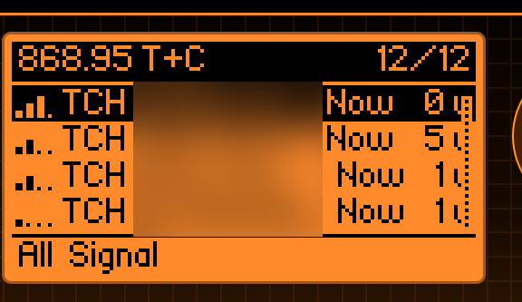
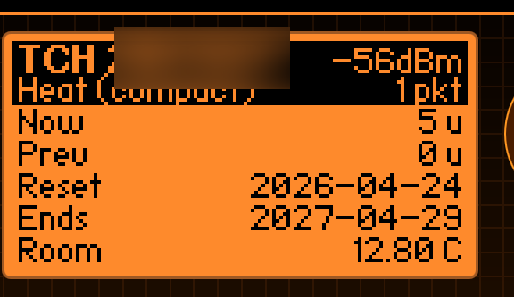

<div align="center">


**Passive wireless M-Bus listener for the Flipper Zero**

Read EU utility meters (heat, water, gas, electricity, heat-cost allocators)
on the 868 MHz band using only the CC1101 — internal or external module.

[](https://github.com/i12bp8/wmbuster/actions/workflows/ci.yml)
[](https://github.com/i12bp8/wmbuster/releases/latest)
[](LICENSE)
[](https://flipperzero.one)
[](https://i12bp8.github.io/wmbuster/)
[](#what-it-does-not-do)

[**Project page**](https://i12bp8.github.io/wmbuster/) &nbsp;·&nbsp;
[**Releases**](https://github.com/i12bp8/wmbuster/releases) &nbsp;·&nbsp;
[**Changelog**](CHANGELOG.md) &nbsp;·&nbsp;
[**Disclaimer**](DISCLAIMER.md) &nbsp;·&nbsp;
[**Contributing**](drivers/CONTRIBUTING.md)

<br/>


&nbsp;&nbsp;


</div>

---

> [!CAUTION]
> **Only point this app at meters you own.** Decrypting someone else's meter
> is illegal in most jurisdictions. The author does not condone unlawful use
> and is not responsible for what you do with this tool. Read the full
> [**Legal Disclaimer**](DISCLAIMER.md) before installing.

> [!IMPORTANT]
> **wM-Buster is receive-only.** It never transmits, jams, replays, or
> spoofs. It is a passive analyser, by design.

---

## Features

- **All four EU modes** — T1, C1, T+C combined, S1.
  T+C is the default and decodes both T-mode (3-of-6) and C-mode (NRZ
  Format A & B) on a single chip configuration via post-sync byte detection
  (`0xCD` / `0x3D` / fall-through).
- **External CC1101 module support** — Settings → Module → External routes
  RX through the GPIO-header module for noticeably better range and a
  proper external antenna. Auto-falls-back to the internal radio when no
  module is present. *(New in 1.1.0.)*
- **EN 13757-3 application layer** — DIF/VIF walker covering Energy,
  Volume, Mass, Power, Volume flow, Mass flow, Flow / Return / External
  temperatures, Temperature difference, Pressure, On-time, Operating time,
  Date, DateTime, HCA units, Fabrication number, Bus address.
- **AES-128 mode 5 decryption** — drop a `keys.csv` on the SD card and
  encrypted meters automatically decrypt to readable rows.
- **Manufacturer drivers** — Techem (HCA / heat / water / smoke), Kamstrup,
  Diehl / Hydrometer / Sappel / IZAR, Qundis / ista / Brunata, BMeters,
  Engelmann, Sontex, Zenner, Apator, GWF, BFW, and more.
- **Custom canvas UI** — meter list with RSSI bar, packet counts, and a
  per-meter detail page with the parsed values, raw hex, and frame stats.
- **SD logging** — raw + parsed telegrams to `/ext/apps_data/wmbuster/` for
  offline analysis with `rtl_433` or `wmbusmeters`.

> [!TIP]
> Don't see your meter? Most unknown meters still produce useful output via
> the OMS DIF/VIF fall-through walker. If yours doesn't, see
> [**Adding a driver**](#adding-a-driver) — porting from `wmbusmeters` is
> usually a 50-line job.

## What it does not do

- **No transmit.** Ever. T2 / C2 bidirectional exchanges and meter wake-up
  requests are out of scope by design.
- **No N-mode** (169 MHz narrowband) — the Flipper's CC1101 is hardware-
  locked to the 300 / 430 / 868 MHz SRD subbands.
- **No US protocols** — Itron ERT, Sensus FlexNet, Neptune R900 are
  separate radio stacks and not currently supported. See the
  [project page](https://i12bp8.github.io/wmbuster/) for the rationale.
- **No key cracking, no replay, no spoofing.** This is a viewer.

## Install

> [!TIP]
> Pre-built `.fap` files for every release are attached to the
> [**Releases**](https://github.com/i12bp8/wmbuster/releases) page. Drop
> `wmbuster.fap` into `/ext/apps/Sub-GHz/` on your Flipper's SD card and
> launch from `Apps → Sub-GHz → wM-Buster`.

### Build from source

```sh
# Install ufbt (Flipper's build tool)
pip install --upgrade ufbt
ufbt update --channel=release

# Clone & build
git clone https://github.com/i12bp8/wmbuster.git
cd wmbuster
ufbt                # produces dist/wmbuster.fap
ufbt launch         # flash + start on a connected Flipper
```

Host-side regression tests (no Flipper required):

```sh
make -C tests check
```

## Decryption (AES-128 mode 5)

Newer EU meters (Techem v0x6A, Kamstrup MULTICAL, etc.) ship with AES-128
enabled. Drop a CSV on the SD card at:

```
/ext/apps_data/wmbuster/keys.csv
```

One line per meter, `#` comments allowed:

```csv
# Manufacturer (3 chars), 8-digit hex ID, 32-hex AES-128 key
TCH,27404216,0123456789ABCDEF0123456789ABCDEF
KAM,12345678,FEDCBA9876543210FEDCBA9876543210
```

Restart the app to reload the file. Open **Keys** from the root menu to
confirm the loaded entries (only a fingerprint of each key is shown). When
a matching key is on file the meter row flips from `ENC` to `DEC` and the
decoded reading appears.

> [!WARNING]
> **Never publish AES keys.** They identify a real customer's meter and
> their disclosure can enable billing fraud. The maintainers will delete
> any issue or PR that includes real keys, real IDs, or decrypted
> captures. See [DISCLAIMER §5](DISCLAIMER.md#5-aes-keys).

## Mode selection

| Mode  | Frequency  | Bit rate          | Encoding              | Notes                       |
|-------|------------|-------------------|-----------------------|-----------------------------|
| T1    | 868.95 MHz | 100 kchip/s       | 3-of-6                | Older Techem firmware       |
| C1    | 868.95 MHz | 100 kbit/s        | NRZ, Format A/B auto  | Newer Techem, most Kamstrup |
| T+C   | 868.95 MHz | 100 kbit/s        | T1 or C1, auto-detect | **Default** — broadest      |
| S1    | 868.30 MHz | 32.768 kbit/s     | Manchester            | Legacy water / gas          |

## External CC1101 module

> [!TIP]
> An external module typically buys you **10–20 dB** more sensitivity
> compared with the internal antenna and lets you use a proper SMA antenna.
> Modules from Tindie, AliExpress, or quen0n's PCB all work.

1. Wire the module to the GPIO header — same pin-out as the standard
   Flipper external CC1101 mod (PA7=MOSI, PA6=MISO, PB3=SCK, PD0=CSN,
   PA4=GDO0, GND, 3V3 from pin 9).
2. Open **wM-Buster → Settings → Module → External**.
3. Re-enter the **Scan** view. The OTG rail powers the module while
   scanning and shuts off when you stop.

If the module isn't detected, the app silently falls back to the internal
radio so you never get a black screen.

## Documentation

- **[Project page](https://i12bp8.github.io/wmbuster/)** — landing page,
  screenshots, install steps.
- **[CHANGELOG](CHANGELOG.md)** — release notes, version-by-version.
- **[DISCLAIMER](DISCLAIMER.md)** — full legal terms, prohibited use,
  spectrum / AES policy.
- **[drivers/CONTRIBUTING.md](drivers/CONTRIBUTING.md)** — how to add a
  new manufacturer driver in one C file.
- **[drivers/README.md](drivers/README.md)** — driver layout reference.

## Project layout

```
wmbuster/
├── application.fam          # ufbt manifest
├── wmbus_app.[ch]           # entry point, scene wiring, settings
├── meters_db.[ch]           # bounded in-RAM meter table
├── key_store.[ch]           # AES-key CSV loader
├── logger.[ch]              # SD logging (raw + parsed)
├── protocol/
│   ├── wmbus_3of6.[ch]      # EN 13757-4 §6.2.1.1 chip decoder (T1)
│   ├── wmbus_manchester.[ch]# Manchester decoder (S1)
│   ├── wmbus_crc.[ch]       # CRC-16/EN-13757 + Format A/B verifiers
│   ├── wmbus_link.[ch]      # L/C/M/A/CI parsing, encryption-mode tag
│   ├── wmbus_app_layer.[ch] # DIF/VIF walker + renderer
│   ├── wmbus_aes.[ch]       # AES-CBC over furi_hal_crypto
│   ├── wmbus_manuf.[ch]     # 16-bit manuf code <-> 3-letter ASCII
│   └── wmbus_medium.[ch]    # device-type code -> human string
├── subghz/
│   ├── wmbus_worker.[ch]    # CC1101 worker, slicer, CRC, dispatch
│   ├── wmbus_hal_rx.c       # FIFO drain via SPI (int + ext handles)
│   └── wmbus_radio.[ch]     # int/ext device selector (ProtoPirate-style)
├── drivers/
│   ├── engine/              # registry + uniform driver interface
│   ├── _oms_split.h         # shared "OMS prefix -> mfct trailer" helper
│   ├── CONTRIBUTING.md      # how to add a new driver
│   └── europe/
│       ├── techem/          # FHKV-3/4 HCA, heat, water, smoke, MK-Radio
│       ├── kamstrup/        # MULTICAL family
│       ├── diehl/           # Hydrometer / Sappel / IZAR
│       ├── qundis/          # Qundis / ista / Brunata HCAs
│       ├── bmeters/         # Hydrodigit
│       ├── engelmann/       # Hydroclima HCA
│       ├── sontex/          # RFM-TX1 water (legacy + OMS firmwares)
│       ├── zenner/          # Zenner B.One
│       ├── apator/          # NA-1
│       ├── misc/            # GWF water, BFW 240-Radio
│       └── ...              # see drivers/README.md
├── views/                   # canvas widgets + scenes
└── tests/                   # host-side regression tests (no Flipper)
```

## Adding a driver

We've made adding a manufacturer driver as small a job as we could. The
common case is **one C file, ~50 lines**: drop it in
`drivers/europe/<vendor>/<name>.c`, add it to `application.fam` and the
registry.

A worked example for porting from `wmbusmeters` is in
[**drivers/CONTRIBUTING.md**](drivers/CONTRIBUTING.md). Pull requests with
a regression test in `tests/test_ports.c` are merged the fastest.

> [!TIP]
> **Don't include real telegrams from real meters.** Use the public
> wmbusmeters reference telegrams (their repo is GPLv3-licensed,
> compatible with this project) or synthesise a frame.

## Testing

The host test-suite covers every manufacturer driver against the public
`wmbusmeters` reference telegrams:

```sh
make -C tests check
```

For ground-truth validation against an SDR, capture the same air with
`rtl_433`:

```sh
rtl_433 -f 868.95M -s 1.6M -Y minmax -R 104 -R 105 -F json > capture.jsonl
```

(`-R 104` is rtl_433's wM-Bus T+C decoder, `-R 105` is S-mode.)

## Standards & references

- **EN 13757-4** — wM-Bus PHY / link layer.
- **EN 13757-3** — application layer (DIF/VIF).
- **OMS Specification Vol. 2** — profile + encryption.
- **TI SWRA522** — CC1101 wM-Bus implementation note.

The decoders were cross-checked against:

- **Your own meter** — typically legal under EU Directive 2018/2002
  Art. 9-11, which gives consumers a statutory right of access to
  their own consumption data. However, operators are not legally required 
  to provide the AES-128 key for the RF interface, as the symmetric key 
  often poses a security and configuration risk. Some providers may hand 
  it over upon request, but acquiring the key is your responsibility. 
  Equivalent rules exist in non-EU jurisdictions.
- **Other meters** — can constitute unlawful interception of private
  communications and unlawful processing of personal data under GDPR
  (or equivalents). Check your national statutes before pointing this
  app at a meter that isn't yours.

## Contributing

Contributions welcome — bug reports, driver ports, UI polish, docs.

1. **Open an issue first** for non-trivial changes so we can sanity-check
   the approach.
2. **Stick to the existing style**: tabs in `Makefile`, 4-space indent in
   C, no Doxygen, comments explain *why* not *what*.
3. **Add a test** in `tests/test_ports.c` for any new driver — telegrams
   from `wmbusmeters/tests/test_*.txt` are fair game.
4. **Run** `make -C tests check && ufbt` locally and make sure both pass.
5. **Don't commit real keys, real meter IDs in clear, or decrypted
   captures of meters that aren't yours.** PRs containing those will be
   force-pushed clean.

See [drivers/CONTRIBUTING.md](drivers/CONTRIBUTING.md) for the driver
walkthrough and [DISCLAIMER §5](DISCLAIMER.md#5-aes-keys) for the data
hygiene policy.

## Roadmap

- Driver ports for the long tail of EU water meters still missing
  (Maddalena, Aquametro, Sensus iConA, Itron Cyble, Elster v200H).
- In-app key-fingerprint search (paste a hex, find which meter uses it).
- RSSI history sparkline per meter on the detail page.
- Translations.

US protocols (Itron ERT, Neptune R900, etc.) are **out of scope** — they
are different radio stacks. A separate sister-app would be the right
vehicle if anyone wants to write one.

## Acknowledgements

Standing on the shoulders of giants — see [Standards & references](#standards--references)
above. Special thanks to the wmbusmeters maintainers for keeping every EU
meter quirk documented in plain code, and to the Flipper Zero open-source
community for the SubGHz device-plugin abstraction that makes external
CC1101 support a dozen-line job.

## License

Released under the **GNU General Public License v3.0 or later** — see
[`LICENSE`](LICENSE) for the full text. In short: you may use, study,
modify, and redistribute this software, but any redistributed copy or
derivative work must remain under GPLv3 and ship its complete
corresponding source. The `_refs/` directory used during development is
not shipped in the `.fap` and remains under its upstream licences.
